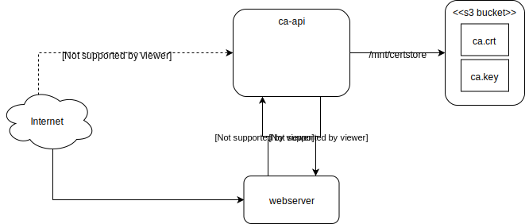

# Certificat Authority (CA)

This subproject describes the setup of our certificate authority.

The goal is to have a fully automated CA that can deliver new SSL certificates to webservers on the fly.

Steps to reach this goal

1. 
